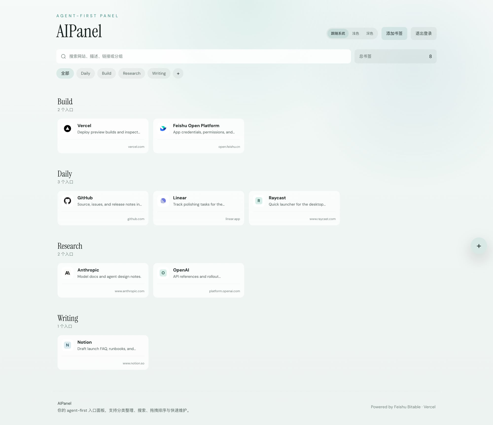
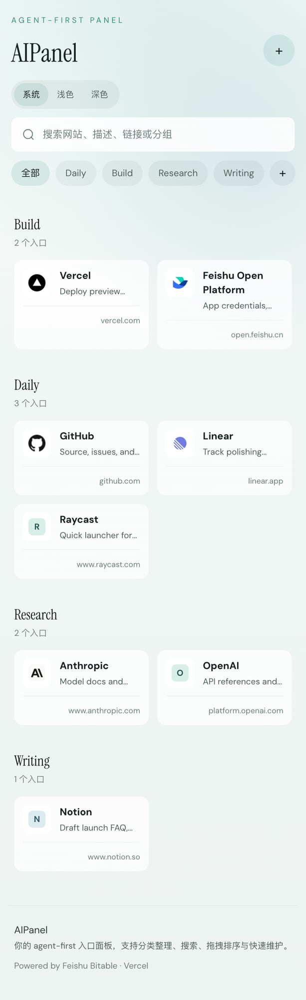
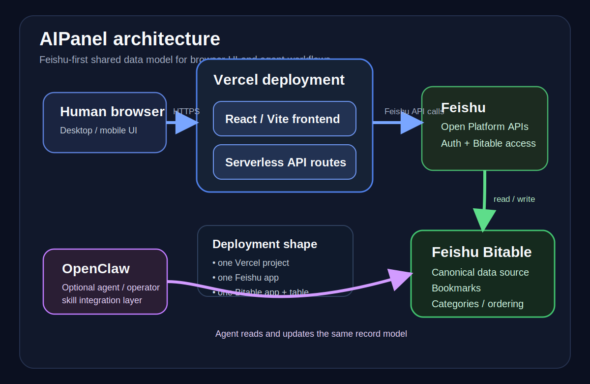

# AIPanel

一个以 Agent 为优先、由飞书多维表格驱动的轻量书签与运营面板。

[English README](./README.md)

AIPanel 的核心思路很简单：**Agent 和人都应该操作同一份结构化数据源**。
浏览器是给人用的界面。
飞书多维表格是事实来源。
OpenClaw 是可选的 Agent / 运维层。

## 预览

| 桌面端 | 移动端 |
| --- | --- |
|  |  |

## 为什么是 AIPanel

大多数书签面板是 UI-first 的，但 AIPanel 不一样：

- **Agent-first 数据模型**：同一份书签数据既可以给 AI Agent 操作，也可以给人在浏览器里维护
- **统一事实来源**：分类、记录和顺序都存储在飞书多维表格里
- **务实的人类界面**：Web UI 很轻，重点是快、顺手、适合浏览和维护
- **自然语言操作**：OpenClaw 集成可以直接增删改查、排序、审计面板数据
- **部署面小**：当前架构下，一个 Vercel 项目 + 一个飞书应用 + 一张多维表格就够了

## 核心能力

- 密码保护的 Web 面板
- 书签浏览与搜索
- 置顶与最近访问
- 分类标签与拖拽排序
- 新建 / 编辑 / 删除书签流程
- 目标链接元数据抓取
- 基于飞书多维表格的 API 层
- 面向同一份数据集的 OpenClaw skill

## 架构速览



AIPanel 使用一套 Feishu-first 的架构：

- **Vercel** 承载 Web 应用和 API
- **飞书多维表格** 是唯一事实来源
- **OpenClaw** 可以通过 skill 操作同一份数据
- **浏览器 UI** 是给人使用的控制面

## 快速部署

AIPanel 现在已经提供通过 OpenClaw 触发的一句话安装路径。

推荐流程：

1. 安装 AIPanel installer skill
2. 确保 Feishu / Lark 与 Vercel 能力已经授权
3. 对 OpenClaw 说：`开始创建 AIPanel`
4. 在需要时只提供最后两个输入项：
   - `ACCESS_PASSWORD`
   - 与自动识别到的 `FEISHU_APP_ID` 对应的 `FEISHU_APP_SECRET`
5. 让安装器继续完成：
   - preflight
   - Feishu Bitable 创建
   - env 组装
   - Vercel 部署
   - 最终 verify

如果你更偏好手动部署，项目依然支持直接通过 Vercel + 手动 env 配置完成安装。

[](https://vercel.com/new/clone?repository-url=https://github.com/simmzl/AIPanel)

规范 env：

```env
APP_NAME=AIPanel
ACCESS_PASSWORD=change-this-to-a-real-password
JWT_SECRET=change-this-to-a-long-random-secret
FEISHU_APP_ID=cli_xxx
FEISHU_APP_SECRET=xxx
FEISHU_BITABLE_APP_TOKEN=bascn_xxx
FEISHU_BITABLE_TABLE_ID=tblxxxxxx
FEISHU_BITABLE_SOURCE_URL=https://your-domain.feishu.cn/base/xxxxxxxx?table=tblxxxxxx
```

部署文档：

- [一句话安装器方案](docs/product/aipanel-one-command-installer-plan.md)
- [Vercel 部署](docs/deploy/vercel.md)
- [Feishu app + Bitable 配置](docs/datasource/feishu-bitable.md)
- [故障排查](docs/troubleshooting.md)

## OpenClaw 集成

**不用 OpenClaw，也可以直接使用 AIPanel。**
OpenClaw 是可选项，只有当你想让 Agent 参与操作时才需要它。

AIPanel 附带 OpenClaw skill 模板和 render 后的分发目录。

当前打包方式：

- 编辑 `integrations/openclaw-skill/`
- 将 `skills/aipanel-feishu-bitable/` 视为 render 后的分发目录
- 通过 `integrations/install-scripts/install-openclaw-skill.sh` 安装

本地可选 render：

```bash
node scripts/render-openclaw-skill.mjs
```

更多说明：

- [OpenClaw 集成](docs/integrations/openclaw.md)
- [OpenClaw 兼容性说明](docs/integrations/openclaw-compatibility.md)

## 给贡献者

开发环境、本地运行方式和贡献说明统一放在：

- [Contributing](./CONTRIBUTING.md)

## 项目状态

**支持级别：** experimental  
**许可证：** MIT  
**部署目标：** Vercel + 飞书多维表格

当前已经可以做到：

- 面板本身可以作为真实产品部署运行
- 飞书多维表格是唯一事实来源
- OpenClaw 集成已经可用
- clean-clone install / build / render / install 流程已验证

仍在继续完善的部分：

- demo GIF / 视频素材
- 脱离当前 AIPanel schema 的更泛化 skill 形态
- 少量与历史项目上下文相关的发布策略收尾

## 文档导航

建议先看：

- [文档索引](docs/README.md)
- [架构概览](docs/architecture.md)
- [部署到 Vercel](docs/deploy/vercel.md)
- [飞书多维表格配置](docs/datasource/feishu-bitable.md)
- [OpenClaw 集成](docs/integrations/openclaw.md)
- [故障排查](docs/troubleshooting.md)

更深入的项目文档：

- [开源就绪清单](docs/product/open-source-readiness-checklist.md)
- [路线图](docs/product/roadmap.md)
- [Release Notes 模板](docs/product/release-notes-template.md)

## 环境变量命名说明

新的配置请统一使用：

- `FEISHU_BITABLE_APP_TOKEN`
- `FEISHU_BITABLE_TABLE_ID`

公开文档和部署流程里，只使用这两个名字。

## 总结

AIPanel 是一个很实用的起点，适合希望让人和 Agent 通过 Web UI + OpenClaw 一起操作同一份飞书多维表格数据的团队。
